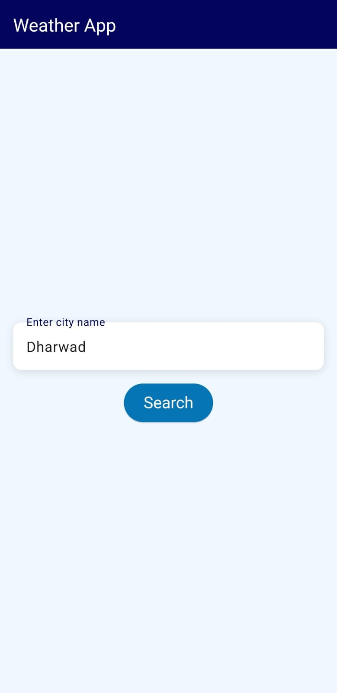
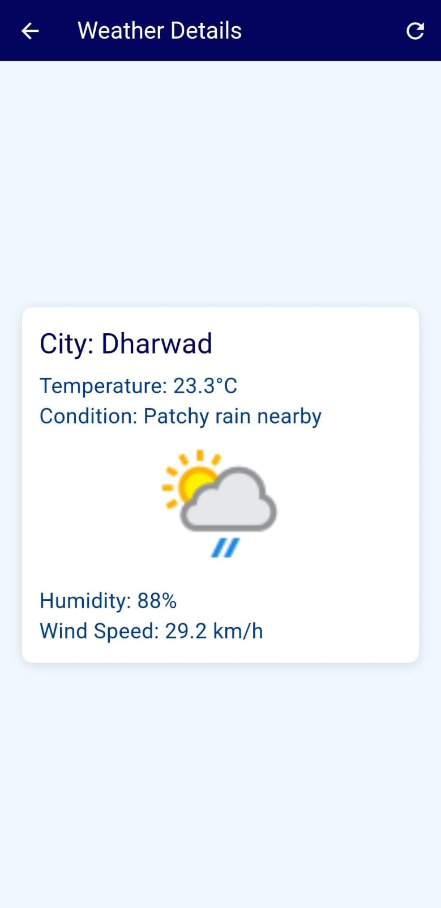

# Weather App

A Flutter application that fetches real-time weather data using the WeatherAPI.com API and displays it in a user-friendly interface.

## Features

- **Weather Search:** Enter a city name to fetch current weather information.
- **Persistent Storage:** Remembers the last searched city using SharedPreferences.
- **Detailed Weather Display:** Shows temperature, weather condition, humidity, and wind speed.
- **Refresh Option:** Allows users to update weather data for the current city.

## Screenshots

## Technologies Used

- Flutter
- Dart
- WeatherAPI.com API

## Dependencies

The project uses the following dependencies:

- **http:** ^0.13.3
- **shared_preferences:** ^2.0.8

## Getting Started

1. **Prerequisites:**
   - Ensure Flutter is installed. For installation instructions, visit [Flutter.dev](https://flutter.dev/docs/get-started/install).
   
2. **Setup:**
   - Clone the repository: `git clone https://github.com/yourusername/weather-app.git`
   - Navigate to the project directory: `cd weather-app`
   - Run `flutter pub get` to install dependencies.
   
3. **Run:**
   - Connect your device or emulator.
   - Run `flutter run` to start the application.

## How to Use

1. Enter a city name in the input field.
2. Tap the "Search" button to fetch and display weather data.
3. The app will show detailed weather information on a new screen.
4. Use the refresh button on the weather details screen to update the weather data.

## Contributing

Contributions are welcome! Please fork the repository and create a pull request for any new features or bug fixes.

